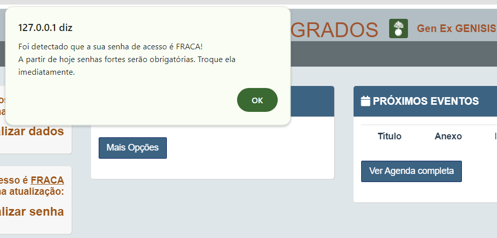
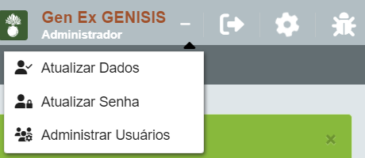
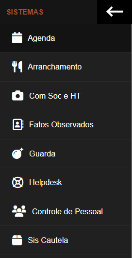
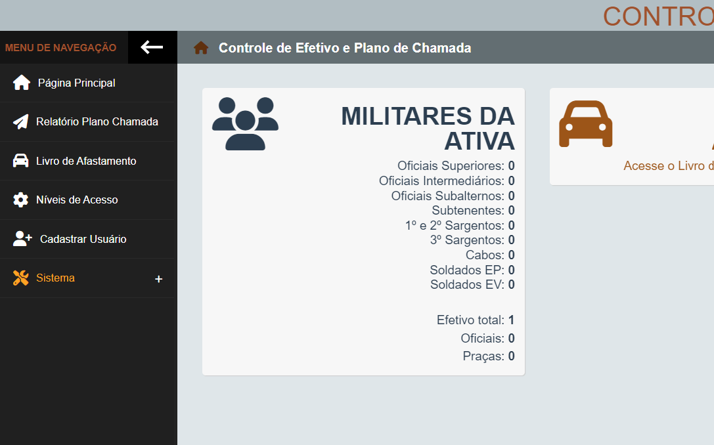

# Sistemas Integrados de Organização Militar

Os Sistemas Integrados (SISINT) é um portal que engloba diversos sistemas para o apoio a rotinas de uma organização militar.
Foi criado inicialmente para atender a 3ª Bateria de Artilharia Antiaérea, mas com alguns ajustes, agora é possível atender muito mais OM do Exército.
Por ser um sistema Web, o usuário final pode acessar usando um computador conectado na Rede Corporativa. Não possui custo operacional, pois o sistema pode funcionar no mesmo servidor da página da Intranet da OM.


## Visão Geral

Esse projeto contempla os seguintes serviços:

- Arranchamento
    - Permite o arranchamento individual e coletivo
    - Gera relatório de arranchamento
    - Permite o cadastro de cardápio

- Controle de FO de Cb/Sd
    - Cadastros e elaboração de relatórios individuais e coletivos

- Helpdesk para a Seção de TI
    - Permite troca de mensagem para solicitação de serviços
    - Permite consulta do status do pedido

- Sistema de controle de cautelas do Encarregado de Material
    - Permite o cadastro e controle do material cadastrado
    - O militar pode consultar o material que tem cautelado nos depósitos
    - O Enc Mat pode cadastrar auxiliares
    - Pode gerar relatórios por militar, por material ou geral

- Gestão de hóspedes ao hotel de trânsito
    - controle visual de quais reservas foram feitas
    - calendário mensal de hospedes para impressão

- Agenda
    - agenda visual
    - os eventos podem ser cadastrados como privados, públicos ou compartimentados com um usuário de escolha
    - permite o envio de anexos ao evento (ex: Ordem de Instrução)

- Controle de Pessoal
    - Livro de Afastamento da Guarnição
    - Aniversariantes do mês
    - Cadastro/Desativação/Modificação do Público interno
    - Relatório do plano de chamada com link para conversa no Whatsapp e busca de endereço no google maps
    - Ficha do Cadben para impressão
    - Controle do quantitativo do efetivo existente

- Guarda
    - Livro de Partes do Of Dia
    - Controle de entrada e saída de:
        - Visitantes / veículos
        - Militares
        - Viaturas
        - Rondas / permanências
        - Quartos de hora
        - Armamento
- Outros
    - Consulta a Boletins Internos da OM (Importado do SISBOL)
    - Obriga o usuário a atualizar seus dados
    - Obriga o usuário a manter senha forte e bloqueia por um dia o usuário que errar a senha 10 vezes consecutivas
    - gera logs de quase todos os eventos, permitindo auditoria dos dados
    - permite a criação de backup
    - níveis de acesso

## Pré-requisitos

São requisitos para o sistema funcionar corretamente:

- Debian (Recomendado versão mais atualizada)
- Apache2 (Recomendado versão mais atualizada)
- PHP 7.2 ou superior (recomendado 8+)
- MariaDB e PHPMyAdmin (Recomendado versão mais atualizada)
- 1 Gb de armazenamento livre (Recomendado 10+ Gb)
- Memória RAM de 4 GB (Recomendado 8+ Gb)

Obs: Para ambiente de testes e desenvolvimento, usei Windows 10 + XAMPP + VS Code + Google Chrome

## Instalação

1. Com os requisitos de Software acima, navegue até o diretório:

```bash
cd /var/www/html/
```

2. Clone este repositório:

```bash
git clone https://github.com/dirfel/sisint.git
```

3. Navegue até o diretório do projeto:

```bash
cd sisint
```

4. Altere as informações do Sistema:

```bash
nano ./recursos/models/conexao.php   # pode ser feito através do VS Code ou outro editor
```

4. 

## Configuração

1. Abra o arquivo de configuração:

```bash
nano recursos/models/conexao.php
```
- A variável test deve estar em true somente em servidor de desenvolvimento e testes.

2. Configurações adicionais, sugeridas:

- Alterar o arquivo ./recursos/assets/favicon.png pelo ícone desejado (Recomendo que seja no mesmo tamanho); e
- Alterar o arquivo ./recursos/assets/wallpaper.png por uma imagem de sua OM para que possa compor o plano de fundo da tela de login.
- Alterar os serviços e links no arquivo helpdesk/index_userSupAdm.php

## Acesso inicial

1. Inicie a aplicação e permita que seja executada ao inicializar o sistema operacional:

```bash
sudo systemctl start apache2
sudo systemctl start mysql
sudo systemctl start apache2

```

2. Abra o navegador e acesse usando o link http://endereco/sisint , aqui deve aparecer ua tela de login.
    - IMPORTANTE: teste também se o arquivo http://endereco/sisint/recursos/models/conexao.php ou http://endereco/sisint/recursos/models/conexao.php~ não exibe a senha do banco de dados publicamente, caso esteja, altere as configurações do Apache.

3. Acesse o endereço http://endereco/phpmyadmin (realize o login se for necessário)
    - Importe o arquivo database.sql

3. Realize o login com a conta pré-cadstrada:
    CPF: 12312312300
    Senha: 12312312300

## Capturas de Tela


Você será solicitado a trocar de senha e mais tarde para atualizar seus dados do Plano de Chamada, siga as instruções para cadastrar uma senha forte.

Vamos começar a ver como é o nosso sistema:


No painel superior você pode verificar em qual módulo do sistema você está.


Passando o mouse sobre ícones podemos ver a dica da sua função. Na imagem estão os botões de logout, tela inicial e reportar erro. Clicamos sobre a engrenagem.


O menu lateral tem suas funções variadas conforme onde estamos navegando. Nele temos os principais atalhos para as funcionalidades. Acessaremos controle de pessoal


Observe que o menu lateral possui outros link. Aqui poderemos clicar em adicionar usuários.

Chegou a hora de cadastrar o efetivo de nossa OM, esse trabalho é manual e precisa ser feito com calma, atentanto principalmente ao cadastro do CPF, por este ser o dado de login e senha inicial e do nível de acesso do usuário. A atualização dos dados pode ser feito posteriormente, pemitindo desativar usuários.

O próximo passo é realizar o cadastro das viaturas em http://endereco/sisint/logistica/gestao_viaturas.php
Obs: O Módulo logística não esta 100% implementado, por isso não há link que direcione o usuário a essa pasta.


## Contribuição

Em breve criarei um TODO_LIST e disponibilizarei para direcionar esforços a quem queira contribuir.
Se quiser contribuir, siga os passos abaixo:

1. Faça um fork do projeto.
2. Crie uma branch para sua feature: `git checkout -b feature-nova`.
3. Faça commit das suas alterações: `git commit -m 'Adicione uma nova feature'`.
4. Faça push para a branch: `git push origin feature-nova`.
5. Abra um pull request.

## Licença

Este projeto é licenciado sob a [Licença Pública Geral GNU (GPL) versão 3](LICENSE).
